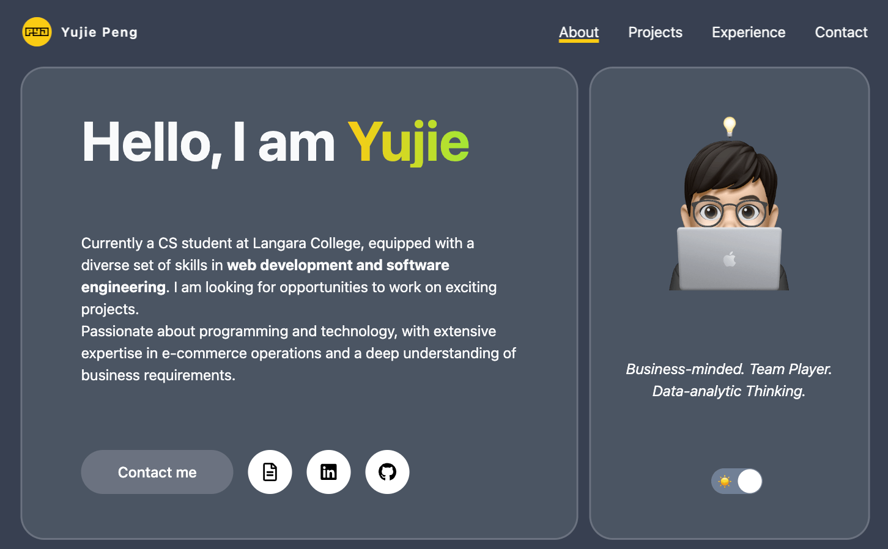

Hi, I'm Yujie, this repo is the source code of my personal portfolio website. I built this website to showcase my projects and skills. I used Next.js, TypeScript, Tailwind CSS, and Framer Motion to build this website. It is hosted on GitHub Pages.

You can check out the website **[here](https://peng-yujie.github.io/MyPortfolio/)**.



## Tech Stack

     

## Run Locally

1. Clone the project

```bash
  git clone https://github.com/Peng-Yujie/MyPortfolio.git
```

2. Go to the project directory

```bash
  cd MyPortfolio
```

3. Install dependencies

```bash
  npm install
```

4. Run the development server:

```bash
  npm run dev
```

5. Open [http://localhost:3000](http://localhost:3000) with your browser to see the result.

## Learn More

This is a [Next.js](https://nextjs.org/) project bootstrapped with [`create-next-app`](https://github.com/vercel/next.js/tree/canary/packages/create-next-app).

To learn more about Next.js, take a look at the following resources:

- [Next.js Documentation](https://nextjs.org/docs) - learn about Next.js features and API.
- [Learn Next.js](https://nextjs.org/learn) - an interactive Next.js tutorial.

You can check out [the Next.js GitHub repository](https://github.com/vercel/next.js/) - your feedback and contributions are welcome!

## References

- [Tailwind CSS](https://tailwindcss.com/docs)
- [GitHub Pages](https://docs.github.com/en/pages)
- Get inspiration for the design from [Nev Flynn's Portfolio](https://nevflynn.com/)
- Get starter code from [Built With Code](https://github.com/Built-With-Code/nextjs-portfolio-website.git)
